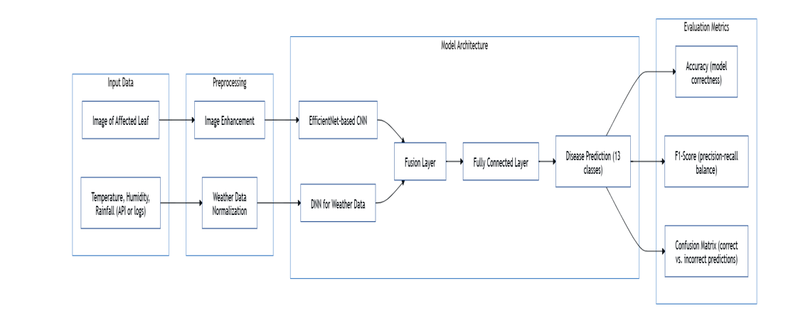

# 🌾 Weather-Aware Paddy Disease Detection using Deep Learning and Meteorological Data

A hybrid deep learning project that integrates computer vision and real-time weather data to accurately detect paddy crop diseases. This solution enhances traditional image classification models by incorporating environmental context such as temperature, humidity, and rainfall—critical factors in disease manifestation.

---

## 🎯 Project Objective

To develop an accurate and scalable model for detecting paddy leaf diseases by fusing image-based features with weather data using CNN-based architectures. The final optimized model, EfficientNetV2-L, achieved **91.68% accuracy**, demonstrating the benefit of context-aware learning.

---

## 📦 Dataset Overview

### 📸 Paddy Leaf Image Data
- **Source**: [Paddy Doctor Dataset (IEEE Dataport)](https://ieee-dataport.org/documents/paddy-doctor-visual-image-dataset-automated-paddy-disease-classification-and-benchmarking)
- **Size**: 16,000+ labeled images across 13 classes (12 disease types + healthy)
- **Format**: Structured folder directories per class

### 🌦 Weather Data
- **Source**: [OpenWeatherMap API](https://openweathermap.org/api)
- **Attributes**: Temperature, humidity, wind speed, rainfall, date
- **Purpose**: Complement image data with environmental indicators relevant to disease spread

---

## 🔍 Research Questions

1. How have hybrid CNN-weather models improved disease detection accuracy over image-only models?
2. What weather conditions are most correlated with specific paddy leaf diseases?
3. Which deep learning model architecture performs best in the hybrid setup?

---

## ⚙️ Methodology

### 📊 Data Processing
- Images resized to `224x224`, normalized, and one-hot encoded
- Weather data cleaned, aligned to image labels by timestamp/region, and scaled using standard normalization

### 🧠 Model Architectures Explored
| Model               | Summary                                             |
|---------------------|-----------------------------------------------------|
| Baseline CNN        | Custom 3-layer convolutional neural network         |
| MobileNet V2        | Lightweight model for embedded/mobile deployment    |
| ResNet-34 (FastAI)  | Residual learning for deeper feature extraction     |
| VGG-16              | Deep model with sequential convolutional layers     |
| Xception            | Inception-style model with depthwise convolutions   |
| **EfficientNetV2-L**| ✅ Final model – best accuracy & scalability tradeoff|

---

## 📈 System Architecture Diagram

> This diagram presents the complete workflow of the hybrid paddy disease detection model. It shows dual input streams: leaf image data and weather parameters (temperature, humidity, rainfall), which are preprocessed and passed into an EfficientNet-based CNN and a DNN, respectively. Features are fused and classified into 13 disease categories, evaluated using accuracy, F1-score, and a confusion matrix.

---
## 👨‍💻 Author

**Achyuth Kumar Miryala**  
M.S. in Data Science, University of North Texas (May 2025)  
📫 Email: [achyuthkumar286@gmail.com](mailto:achyuthkumar286@gmail.com)  
🔗 LinkedIn: [linkedin.com/in/achyuthkumarmiryala](https://www.linkedin.com/in/achyuthkumarmiryala/)

